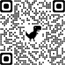
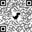

# pulamusic

## Jim Carroll, Ph.D. | [Instructional Designer, Cultural Historian, Musician](https://github.com/pulamusic)

[***pulamusic***](pulamusic.com) is a brand name I created a number of years ago to represent the breadth of what I do as an academic and musician. The word *pula* means *rain* in Setswana, the national language of Botswana where I lived and worked as a teacher and trainer from 1991-99. Since Botswana is a desert country -- the Kalahari Desert -- rain is an important environmental element, bringing life and luck and prosperity. It is an image that rings true to me still in terms of how I approach my work and the people around me.

---

**Music is at the core of everything I do as a teacher and academic**. [Let me leave that to speak for itself. Click here or on the image below to visit my audio portfolio on SoundCloud.](https://soundcloud.com/pulamusic).

<figure>
  
  <figcaption>Kalahari Duolian</figcaption>
</figure>

---

## pulamusicMedia

**pulamusicMedia** is the organizational name I use for my instructional design consultancy. I haven't yet finished a website, but there will be one or more sites soon.

---

<a href="mailto:contact@pulamusic.com"><h2 align="center">Please feel free to contact me</h2></a>

---

