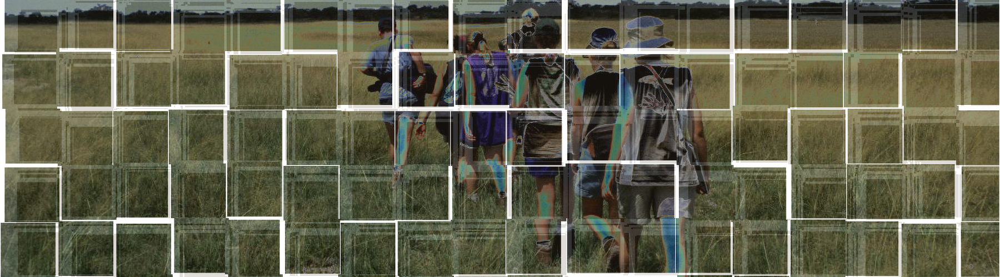
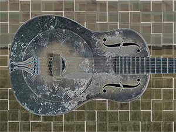

<link href="assets/styles.css" rel="stylesheet" type="text/css">

> Jim Carroll, Ph.D. |
> [Instructional Designer, Cultural Historian, Musician](https://github.com/pulamusic)

<a href="mailto:contact@pulamusic.com"><h4 class="contact">Please feel free to contact me</h4></a>

---

# pulamusic

***pulamusic*** is a brand name I created a number of years ago to represent the breadth of what I do as an academic and musician. The word *pula* means *rain* in Setswana, the national language of Botswana where I lived and worked as a teacher and trainer from 1991-99. Since Botswana is a desert country -- the Kalahari Desert -- rain is an important environmental element, bringing life and luck and prosperity. It is an image that rings true to me still in terms of how I approach my work and the people around me.

Music is at the core of everything I do as a teacher and academic. [Let me leave that to speak for itself](https://soundcloud.com/pulamusic).

<!--
**pulamusic/pulamusic** is a ✨ _special_ ✨ repository because its `README.md` (this file) appears on your GitHub profile.

Here are some ideas to get you started:

- 🔭 I’m currently working on ...
- 🌱 I’m currently learning ...
- 👯 I’m looking to collaborate on ...
- 🤔 I’m looking for help with ...
- 💬 Ask me about ...
- 📫 How to reach me: ...
- 😄 Pronouns: ...
- ⚡ Fun fact: ...
-->
